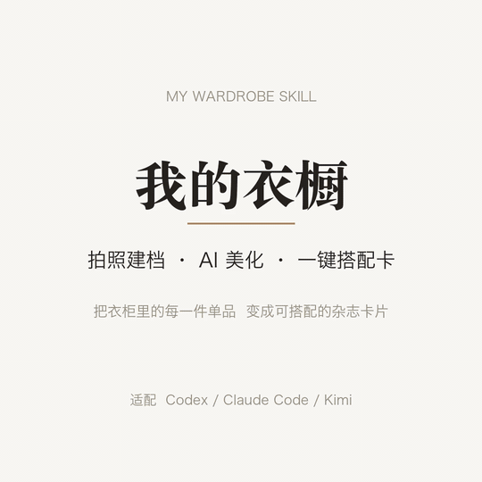

# 我的衣橱 2.0 · My Wardrobe 2.0

> 批量拍照建档 · AI 美化去皱 · 棚拍级展示 · 拖拽搭配卡 · 二手回收管理
>
> 一个跨平台的 Agent Skill,适配 **Codex / Claude Code / Kimi / TRAE** 等支持 SKILL.md 的 AI 编程/办公助手。

[English README](README_EN.md)



📹 完整演示视频:[docs/demo.mp4](docs/demo.mp4)

## 2.0 新功能

| 功能 | 说明 |
|------|------|
| **批量上传** | 一次上传最多 30 件单品,自动建档 |
| **衣橱管理 Web 应用** | 浏览器直接打开,5 大功能页,无需安装依赖 |
| **分类浏览** | 按种类(slot)+季节(春/夏/秋/冬/四季)筛选,可修改分类 |
| **品牌浏览** | 按品牌分组,无品牌归「未知品牌」,可手动输入品牌名 |
| **拖拽搭配卡** | 画布上自由拖拽、缩放、置顶、移除,输入标题,导出 PNG |
| **展示墙** | 4 列网格按种类排列,统一奶油米色背景 |
| **二手回收** | 不穿的衣服标记为出售(原价+售价+成色+渠道)或捐赠(选机构) |
| **棚拍级单品图** | rembg 精准去背景 + 边缘羽化 + 阴影压制 + 自动色阶 + 品牌标签 |
| **预览墙** | 全部单品 4 列网格一览,统一风格 |

## 它能做什么

1. **批量录入** —— 一次上传最多 30 件单品照片,自动识别品类并抠图建档
2. **AI 美化** —— 实拍褶皱自动抚平,生成透明底、电商级整洁单品图
3. **棚拍级展示** —— 1500×1500 奶油米色画布,统一风格,底部品牌/品类标签
4. **衣橱管理** —— Web 应用分类浏览(种类/季节/品牌),可修改、删除、回收
5. **拖拽搭配** —— 在搭配卡画布上自由拖拽摆位,缩放置顶,输入标题,导出 PNG
6. **二手回收** —— 不穿的衣服标记出售(输入价格)或捐赠(选机构)

## 安装

把本仓库整个目录放进你所用工具的 skills 目录,重命名为 `my-wardrobe`:

| 工具 | 放置位置 |
|------|----------|
| Claude Code | `~/.claude/skills/my-wardrobe/` |
| Codex | `~/.codex/skills/my-wardrobe/` |
| Kimi | 通过技能管理导入 |
| TRAE | `~/.trae-cn/skills/my-wardrobe/` |

放好后对 AI 说「拍下这件衣服,放进我的衣橱」「帮我从衣橱里搭一套通勤装」即可触发。

## 目录结构

```
my-wardrobe/
├── SKILL.md                     # 技能入口:工作流与规则
├── app/
│   └── wardrobe-app.html        # 衣橱管理 Web 应用(5 大功能页)
├── scripts/
│   ├── remove_bg.py             # 本地抠图(rembg)
│   ├── beautify_item.py         # 本地去皱(OpenCV 频率分离)
│   ├── make_studio_cards.py     # 棚拍级单品图生成(rembg 精准去背景)
│   ├── make_contact_sheet.py    # 预览墙生成(4列网格)
│   ├── compose_card.py          # 经典 3:4 带标签搭配卡
│   └── compose_card_xhs.py      # 小红书 9:16 杂志拼贴卡(默认)
├── references/
│   ├── categories.md            # 单品槽位/分类与搭配规则
│   └── style-guide.md           # 视觉规范 + 棚拍级处理管线
├── constraints/
│   └── rules.md                 # 全局约束(数据/图像/预览墙/回收)
├── examples/
│   ├── bulk-upload-workflow.md  # 批量上传工作流示例
│   └── outfit-card-workflow.md  # 搭配卡生成工作流示例
├── assets/                      # 参考图
└── docs/                        # 演示视频、GIF、示例成品
```

## 依赖

- 必需:`python3` + `Pillow`(合成搭配卡)
- 可选:`rembg`(本地抠图)、`opencv-python-headless`(本地去皱)、`numpy`(棚拍级 card)
- AI 抠图/美化优先使用各平台自带的图像生成能力,本地脚本仅作兜底
- Web 应用为纯前端 HTML,无需安装任何依赖

## 使用流程速览

```bash
# 1. 录入:把单品照片发给 AI,或手动抠图
python3 scripts/remove_bg.py 照片.jpg -d items/

# 2. 美化(无 AI 重绘能力时的本地兜底)
python3 scripts/beautify_item.py items/item1.png -o items/item1.png

# 3. 生成棚拍级单品图
python3 scripts/make_studio_cards.py wardrobe.json

# 4. 生成预览墙
python3 scripts/make_contact_sheet.py wardrobe.json

# 5. 生成小红书风搭配卡
python3 scripts/compose_card_xhs.py spec.json -o outfit.png

# 6. 打开 Web 应用管理衣橱
open app/wardrobe-app.html
```

## License

MIT
